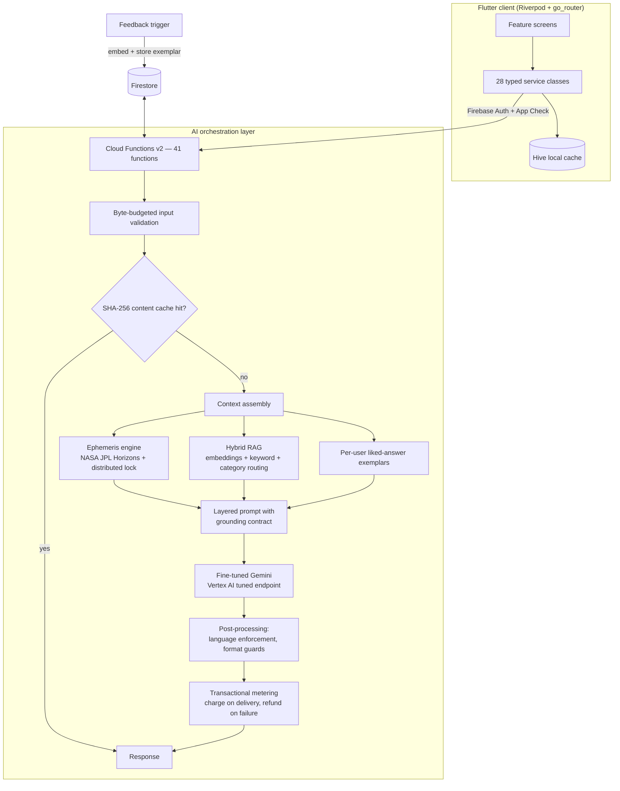

# BHR1GU

**A production Flutter app built around a fine-tuned LLM, hybrid RAG retrieval, and a deterministic astronomy engine — all orchestrated server-side on Firebase.**

BHR1GU is an AI guidance app (domain: Vedic + Western astrology) shipped to the Play Store. The domain is mystical; the engineering problem is not: it's grounding a creative LLM in verifiable computed facts, at consumer-app latency and unit economics, with per-user personalization that improves from feedback. This README focuses on how that's built.


## Engineering highlights

- **Fine-tuned LLM in production** — the chat persona runs on a custom Gemini model, supervised-fine-tuned on Vertex AI with an in-house 400-example dataset pipeline (teacher-prompt generation → JSONL → Vertex tuning schema conversion), served from a private tuned endpoint.
- **Hybrid RAG** — Firestore-backed knowledge collections retrieved with `gemini-embedding-001` vectors + cosine similarity, blended with keyword scoring and question-category routing, behind TTL caches with promise de-duplication.
- **Feedback-driven personalization (RLHF-lite)** — a thumbs-up on any answer fires a Firestore trigger that embeds the Q→A pair as a per-user exemplar; future prompts retrieve the top-k semantically similar "answers this user loved" as few-shot style hints. A down-vote deletes the exemplar. The system measurably adapts per user with no retraining.
- **Deterministic grounding, zero-hallucination contract** — all astronomy is computed, never generated: planetary positions come from the NASA JPL Horizons API, charts from in-house spherical-astronomy code. The LLM is contractually forbidden (and prompt-audited) from citing any placement not present in the injected computed data.
- **Cost & latency engineering** — SHA-256 content-addressed response caching, hourly sky-snapshot caches, nightly precompute jobs, and a Firestore-transaction distributed lock so exactly one function instance computes each day's ephemeris while concurrent callers wait on the result.
- **Transactional AI metering** — quota is dry-run-checked before generation and charged only after a deliverable reply exists, with automatic refund if any downstream step fails. A failed generation never consumes a user's paid message.
- **41 Cloud Functions** (callables, cron schedulers, Firestore triggers) behind Firebase Auth + App Check, with byte-budgeted input validation on every request and all model calls server-side — no API keys ship in the client.

## System architecture



## The AI pipeline in detail

### 1. Model layer

| Concern | Approach |
|---|---|
| Conversational persona | Gemini fine-tuned on Vertex AI, served via tuned endpoint |
| Structured readings (JSON) | `gemini-2.5-flash-lite` with `responseMimeType: application/json` |
| Embeddings | `gemini-embedding-001` for RAG corpora, queries, and feedback exemplars |
| Fallback path | Groq `llama-3.3-70b-versatile` client retained as a deprecated escape hatch |

The tuned-endpoint client handles Vertex API asymmetries explicitly: tuned endpoints don't reliably support `systemInstruction` or `responseMimeType`, so the generation wrapper detects `endpoints/*` models and folds the system prompt into the user turn while standard models use the proper API fields ([functions/src/core.js](functions/src/core.js)).

**Fine-tuning dataset pipeline** ([functions/scripts](functions/scripts)): `generate_dataset.js` samples randomized chart/transit contexts and uses a teacher prompt to synthesize 400 persona-consistent training examples enforcing a strict two-paragraph contract (psychological insight + explicit astrological evidence); `convert_dataset.js` rewrites the JSONL into Vertex AI supervised-tuning schema (`contents` / `systemInstruction`).

### 2. Retrieval (RAG)

Four shared knowledge corpora (`book_knowledge`, `tarot_knowledge`, `compatibility_knowledge`, geomancy) plus one per-user corpus (`liked_answer_knowledge`) live in Firestore with precomputed embeddings. Retrieval is hybrid: keyword score from a lightweight question classifier **+** `cosine_similarity × 10` when embeddings exist, degrading gracefully to keyword-only or recency-ranked results if the embedding call fails. Corpus reads sit behind a 10-minute in-memory TTL cache with in-flight-promise coalescing so cold-start bursts issue one Firestore read, not N.

### 3. Prompt assembly & grounding

Each chat request assembles a layered system prompt from independently maintained blocks: persona/voice with banned-phrase style constraints, safety policy, a **zero-hallucination rule** (any planet/sign/house mentioned must appear verbatim in the injected chart JSON), computed current-sky and transit-aspect context, RAG excerpts, per-user exemplars, and an optional **follow-up priority mode** that re-anchors the model on a prior reading (tarot, geomancy, compatibility, horoscope) with source-specific grounding rules. All injected JSON is size-bounded and truncation-guarded.

### 4. Code-mixed language generation

The app serves English and **Hinglish** (romanized Hindi–English). Language policy is enforced, not hoped for: a marker-based heuristic (`looksLikeHinglish`) detects drift, and a corrective rewrite pass (`ensureHinglishText`) re-prompts the model to restore the target register while preserving named entities and formatting — a practical solution to LLMs' tendency to snap back to English mid-conversation.

### 5. Feedback loop

`chatFeedback` writes trigger [onChatFeedbackWritten](functions/src/triggers/chat_feedback.js): an up-vote embeds the question and stores the Q→A pair keyed to the user; anything else deletes it. The chat callable then retrieves the user's own top-3 semantically similar loved answers as a lowest-priority style hint — explicitly fenced in the prompt so it can never override chart data or retrieved knowledge.

## Deterministic astronomy engine

The LLM never computes astronomy. A ~1,000-line ephemeris layer in [core.js](functions/src/core.js) does:

- **NASA JPL Horizons** queries (observer-ecliptic quantities) for Sun through Saturn, with retry/backoff, per-body pacing, and vector-fallback parsing of the Horizons response format.
- In-house spherical astronomy: Julian dates, Lahiri ayanamsa, mean obliquity, Greenwich/local sidereal time, ascendant calculation, mean lunar nodes (Rahu/Ketu), dual-zodiac output (Western tropical + Vedic sidereal), nakshatra mapping, and whole-house assignment.
- **Birth-time resolution done right**: place → coordinates via Google Places, coordinates → IANA timezone via `tz-lookup`, then historical-offset-aware UTC conversion with `moment-timezone` — so a 1978 birth in a DST-shifting zone resolves correctly.
- **Transit-to-natal aspect matching** with per-planet orbs and theme classification, feeding the prompt a ranked list of the strongest active aspects.
- A separate 1,100-line deterministic [Vedic compatibility calculator](lib/services/vedic_match_calculator.dart) (guna matching) runs client-side; the LLM only narrates its computed scores.

**Concurrency**: daily transits are computed once globally. `getDailyTransits` takes a lease via Firestore transaction (owner UUID + TTL); losers poll until the winner publishes, and a stale lock is reclaimable after expiry — a textbook distributed lock built on primitives the stack already had.

## Reliability, cost, and abuse controls

- **Content-addressed caching**: every generated reading is cached under `sha256(stableStringify(payload))` + a content version string, so prompt iterations bust caches deterministically and identical requests never pay for tokens twice.
- **Precompute pipelines**: nightly cron functions precompute transits and fan horoscope generation out through a Firestore job queue drained by a per-minute processor — users hit warm caches at breakfast.
- **Metering as a transaction**: dry-run entitlement check → generate → post-process → *then* charge → refund if usage logging fails. Server-side RevenueCat sync with idempotent, marker-guarded quota resets on plan upgrades.
- **Input hygiene**: every callable enforces auth, optional App Check, JSON byte ceilings, and bounded string/array/object extraction before any business logic runs.
- **Observability**: per-request usage events record feature, provider, model, and cache status; Crashlytics on the client; structured error surfaces that never leak provider internals to users.

## Flutter client

Riverpod for state, go_router for navigation, Hive for local caching, and a 28-class typed service layer (~6,700 LOC) that treats Cloud Functions as the only AI surface. Product features riding on the platform above: conversational chat with contextual follow-ups, daily readings, tarot and geomancy flows with structured-JSON rendering, social compatibility graph (invites, connection requests, privacy-scoped guidance), RevenueCat subscriptions with rewarded credits and streaks, FCM push driven by the scheduler functions, shareable reading cards, and a sprite-sheet companion character with 14 animation states.

## Repository layout

```
lib/
  screens/          # Feature UI (chat, readings, social, profile, paywall)
  services/         # 28 typed services — API surface, caching, calculators
  models/ providers/ widgets/ theme/
functions/
  src/core.js       # AI clients, RAG, ephemeris engine, caching, validation
  src/callables/    # 11 domain modules (chat, chart, tarot, compatibility…)
  src/scheduled/    # Cron: precompute, notifications, job-queue processor
  src/triggers/     # Firestore triggers (feedback → exemplar pipeline)
  src/monetization/ # Quota, entitlements, RevenueCat sync
  scripts/          # Fine-tuning dataset generation + Vertex conversion
docs/               # Production release checklist
```

## Local development

```bash
flutter pub get
flutter analyze --no-pub
flutter test test/widget_test.dart --no-pub
node --check functions/index.js
```

Firebase config is generated into `lib/firebase_options.dart`. All provider credentials (`GEMINI_API_KEY`, `GROQ_API_KEY`, `GOOGLE_PLACES_API_KEY`, `REVENUECAT_SECRET_API_KEY`) live in Firebase Secret Manager and are injected into functions at deploy time — nothing secret is committed or shipped in the client binary.

## Production release

See [docs/production_release_checklist.md](docs/production_release_checklist.md). In short: secrets configured in Secret Manager, `android/key.properties` created from the example with the keystore kept out of version control, release signing SHA registered for `com.bhr1gu.app`, and the analyze/test/syntax gates above run from a clean workspace before building store artifacts.

---

*The app currently prioritizes preserving the shipped UI and product flow; refactors are kept small, feature-scoped, and covered by checks where possible.*
